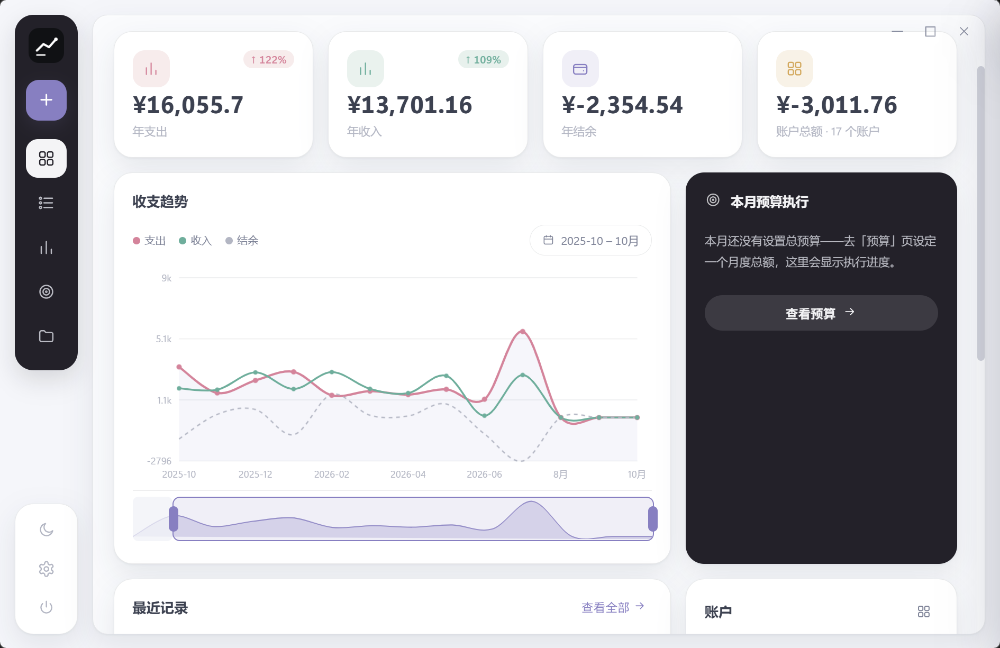
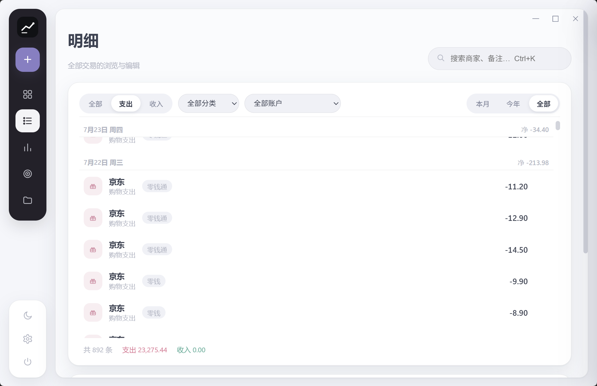
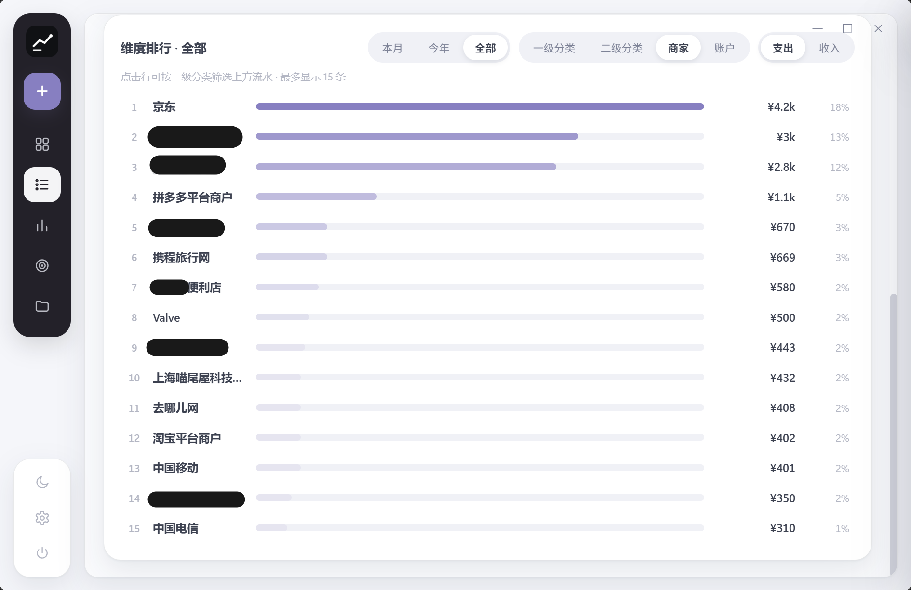
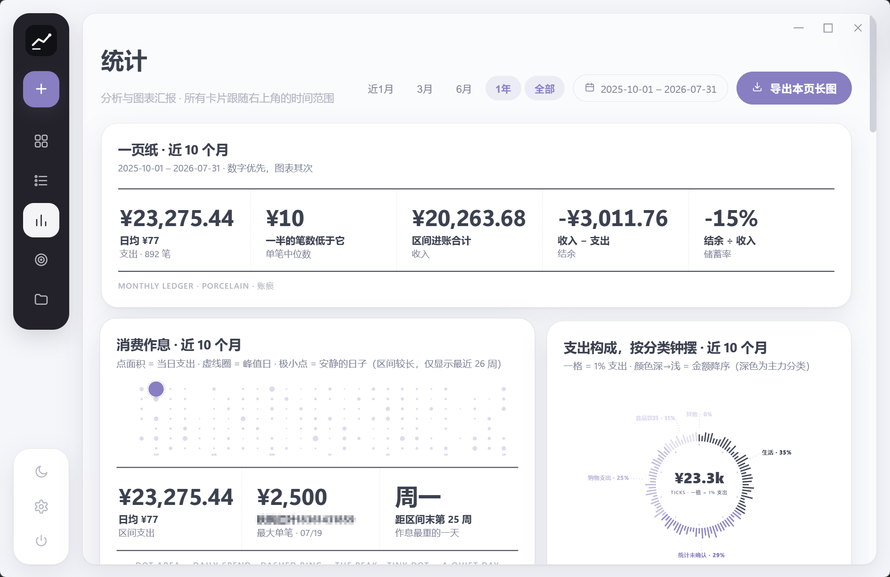
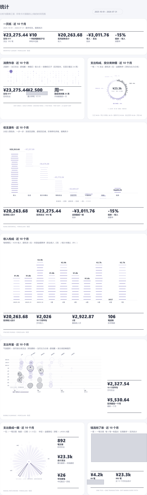

# 账痕 · BillTrace

<p align="center">
  
</p>

<p align="center">
  <strong>绿色免安装的个人账单管理桌面应用</strong><br/>
  导入即分类 · 指纹查重 · 三级分类体系 · 账户余额 · 快速记账 · 图表汇报<br/>
  Tauri 2 · Vue 3 · Rust · SQLite
</p>

<p align="center">
  
  
  
  
</p>

---

## 下载使用（普通用户看这里，无需编译）

**账痕**是一款 Windows 桌面端绿色单文件记账应用：把年度账本 Excel、微信支付流水直接导入，它会按你自定义的**分类体系与商家规则**自动归类、自动查重。数据 100% 本地存储（SQLite），整个目录拷到 U 盘即完成备份迁移。

**推荐方式：直接下载 Release 里的成品 exe，双击即用，不需要安装任何开发环境。**

> 前往 [Releases 页面下载最新版](https://github.com/Frostleaf0929/BillTrace/releases)
> 认准本仓库地址 `Frostleaf0929/BillTrace`——GitHub 上另有拼写近似的他人项目（如 BillTra**k**），注意区分。

**使用环境（就这三条）：**

| 要求 | 说明 |
|------|------|
| Windows 10 / 11（64 位） | 仅支持 Windows 桌面端 |
| WebView2 运行时 | Win10/11 系统自带；若极少数机器启动报错，去 [微软官网](https://developer.microsoft.com/microsoft-edge/webview2/) 装一次即可 |
| 磁盘空间 | 程序约 8MB，账本数据若干 MB |

**三步上手：**

1. 从 Releases 下载 `BillTrace_v0.4.0_x64.exe`（绿色版）或安装包 `setup.exe`；绿色版放到一个单独的文件夹里（比如 `D:\BillTrace\`）；
2. 双击运行——它会在同目录生成 `data\` 文件夹存放账本（SQLite），**拷走整个文件夹 = 备份/迁移**；
3. 首次使用建议顺序：**分类页 → 导入预设** 导入你的分类体系（md/txt）→ **设置 → 导入账单**（随手记 Excel 或微信流水 xlsx）→ 待确认商家归类向导自动弹出，确认一遍即可入库。

不需要 Docker，不需要 PHP，不需要命令行——这是一个**桌面绿色软件**，不是网页应用。

## 核心功能

| 模块 | 能力 |
|------|------|
| 导入 | 随手记格式年度账本 Excel（多 Sheet 自动识别）、微信支付官方流水 xlsx、手动记账；全量指纹查重，重复数据自动跳过 |
| 快速记账 | 任意页面侧栏「记一笔」或 Ctrl+N：金额、分类、账户三步完成；保存后支持一键撤销 |
| 分类 | 支出 / 收入 / 账户三级体系（一级 → 二级 → 小级），树行拖拽调整层级与排序；md / txt 分类预设导入（先预览后写入）与导出 |
| 自动分类 | 商家关键词规则引擎；新商家归类后自动沉淀为规则。分类页提供**已学习规则**管理卡（分页浏览、启停、编辑映射、删除误学规则），并支持「把规则应用到已有账单」——先导账单后导规则也能一键补分类 |
| 概览 | 支出 / 收入 / 结余 / 账户总额四卡（日 / 周 / 月 / 年 / 总 五种范围切换、环比对比）；收支趋势图（可拖拽缩放的时间导航器）；本月预算执行锚点卡；最近记录（点击滑出编辑面板）；账户卡（拖拽排序、双击设基数） |
| 明细 | 全部账目筛选 / 搜索 / 日分组流水；点击行右侧滑出编辑面板；多选后底部批操作条（就地新建分类、移动、删除）；维度排行卡（一级 / 二级 / 商家 / 账户，支持本月 / 今年 / 全部与收支切换） |
| 统计 | 「一页纸」数字总览 + 七张图表汇报卡：消费作息点阵、支出构成钟摆、收支瀑布（收入到结余逐级分解）、收入构成、支出年鉴、支出叠瓦圈、钱流向了谁。全部卡片跟随右上角时间范围联动（近1月 / 3月 / 6月 / 1年 / 全部），支持**导出本页长图** PNG |
| 预算 | 月度总预算 + 分类预算信封，三色进度条（正常 / 预警 / 超支），任意月份跳转 |
| 个性化 | 深浅主题（跟随系统 / 浅色 / 深色，辐射动效切换）、7 种颜色预设 + 自定义色值（统计图表与界面同步换色）、毛玻璃开关 / 强度 / 模糊半径、背景亮度、自定义背景图 |
| 数据 | xlsx / csv 导出（与年度账本格式对齐）、分类体系导出 md / txt、一键备份、清除数据（自动先备份） |

## 界面

v0.4.0 全新界面：两段式深色侧栏 + 卡片网格布局，统计页为纸面质感的自绘 SVG 图表。

### 概览

四张数字卡（五种时间范围切换）、可拖拽缩放的趋势图、预算执行锚点卡、最近记录与账户：



### 明细 · 全流水

日分组流水、待确认徽章、点击行滑出编辑面板：



### 明细 · 维度排行

商家 / 分类 / 账户排行，支持时间范围与收支切换，点击行下钻：



### 统计 · 图表汇报

跟随时间范围联动的八张卡片（一页纸数字 + 七张图表）：



### 统计 · 导出长图

一键把整页导出为一张长图 PNG，方便归档或分享：



### 分类 · 规则管理

三级分类树 + 预设导入导出 + 已学习规则管理（启停 / 编辑 / 删除）：


## 从源码构建（开发者）

普通用户**不需要**这一节——直接去 [Releases](https://github.com/Frostleaf0929/BillTrace/releases) 下载 exe 即可。

**构建环境要求：**

| 依赖 | 版本要求 | 说明 |
|------|---------|------|
| [Node.js](https://nodejs.org/) | ≥ 18（含 npm） | 前端构建 |
| [Rust](https://rustup.rs/) | stable（MSVC 工具链） | 后端编译；Windows 需装 rustup 并选择 `x86_64-pc-windows-msvc` |
| [VS Build Tools 2022](https://visualstudio.microsoft.com/visual-cpp-build-tools/) | 勾选"C++ 生成工具"工作负载 | Rust MSVC 工具链依赖 |
| WebView2 运行时 | Win10/11 自带 | 运行时界面载体 |

**构建步骤（PowerShell）：**

```powershell
# 1. 克隆仓库
git clone https://github.com/Frostleaf0929/BillTrace.git
cd BillTrace

# 2. 安装前端依赖（仅在项目文件夹内，局部安装）
npm install

# 3a. 开发调试（热重载）
npm run tauri dev

# 3b. 或打包发布版（绿色单文件：src-tauri\target\release\zhangji.exe）
npm run tauri build -- --no-bundle
```

真实数据回归测试（设置环境变量指向本地账单数据目录后运行；未设置则自动跳过，不会读取任何隐私数据）：

```powershell
cd src-tauri
$env:ZHANGJI_REAL_DATA_DIR = "你的账单数据目录"
cargo test --test real_data -- --nocapture
```

## 项目结构

```
zhangji/
├── src/                          # Vue 3 前端
│   ├── views/v2/                 # 六个页面：概览 / 明细 / 统计 / 预算 / 分类 / 设置
│   ├── v2/                       # 设计系统层
│   │   ├── icons.ts              # 单色线性图标库（分类图标按名称哈希分配）
│   │   ├── paper.ts / parts.ts   # 多张统计图表的构建器与几何工具
│   │   ├── TsChart.vue           # 收支趋势图（时间导航器 / 十字准线）
│   │   ├── QuickAdd.vue          # 记一笔滑出面板
│   │   ├── TxPanel.vue           # 交易编辑滑出面板
│   │   └── exportStats.ts        # 统计页长图导出（Canvas 复刻）
│   ├── components/               # 导入、预设、归类向导等对话框
│   ├── theme.ts                  # 主题与个性化外观管理
│   └── styles/                   # global.css + v2.css（两段式侧栏 / 卡片 / 纸面图表）
└── src-tauri/                    # Rust 后端
    └── src/
        ├── importer.rs           # Excel/微信流水解析 + 规则引擎 + 查重 + 待确认队列
        ├── presets.rs            # md / txt 分类预设解析
        ├── rules.rs              # 商家关键词规则引擎
        ├── stats.rs              # 统计聚合（趋势 / 维度 / 账户余额）
        ├── exporter.rs           # xlsx / csv / 分类导出
        └── db.rs                 # SQLite 初始化与迁移
```

## 隐私与安全

- 所有数据仅存放在程序同级 `data/` 目录（SQLite），无任何网络上传；
- 「清除数据」执行前会自动备份到 `data/backups/before-clear-*`；
- 仓库与测试数据中不含任何真实账单信息（回归测试需手动设置环境变量才会读取本地数据）。

## 设计语言与致谢

- **图表视觉范式**：参考开源项目 [lieflat-charts](https://github.com/larashero3-dotcom/lieflat-charts)（作者 larashero3-dotcom，PolyForm Noncommercial 1.0.0 许可）。本项目按其视觉理念重新实现了纸面风格的图表（气泡年鉴、放射叠瓦、刻度行、点阵热力、收支瀑布等），未复制其代码；本项目为个人非商业工具，符合该许可的使用范围。
- **界面图标**：参照 [Solar 图标集](https://www.svgrepo.com/collection/solar-bold-icons/)（作者 480 Design，CC BY 4.0 许可，经 SVGRepo 提供）的风格绘制；设置齿轮图标来自 [Lucide](https://lucide.dev/)（ISC 许可）；分类图标为项目自绘。
- **界面布局**：参考 Dribbble 上的公开设计稿——[Retail POS](https://dribbble.com/shots/27083535-Retail-POS-Web-UI-UX-Design)（Ronas IT）、[Finova](https://dribbble.com/shots/26390511-Finova-Finance-Dashboard-UI)（Rashedul Islam）、[Folia](https://dribbble.com/shots/27262894-Folia-Finance-Dashboard-Design)（Oyasim Ahmed），仅借鉴布局与配色思路。
- **技术栈**：[Tauri](https://tauri.app/) · [Vue 3](https://vuejs.org/) · [Element Plus](https://element-plus.org/) · [calamine](https://github.com/tafia/calamine) · [rusqlite](https://github.com/rusqlite/rusqlite)
- 本项目为 **Vibe Coding** 实践，由 [ZCode](https://www.zcode.com) 智能体驱动，编码模型 **GLM**（Z.ai）完成全部开发

## 作者

**[Frostleaf0929](https://github.com/Frostleaf0929)**

## License

[MIT](./LICENSE)
